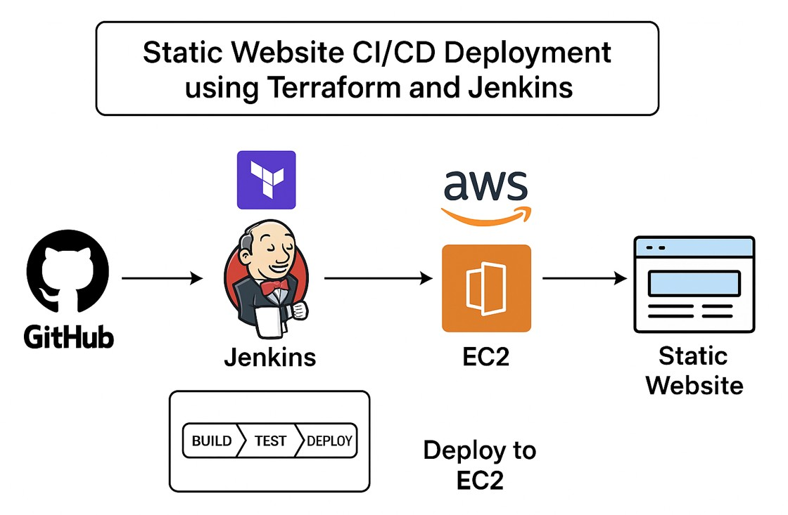
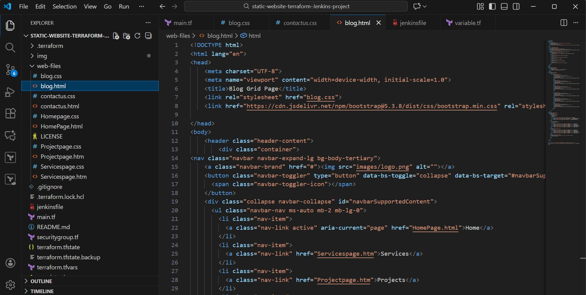
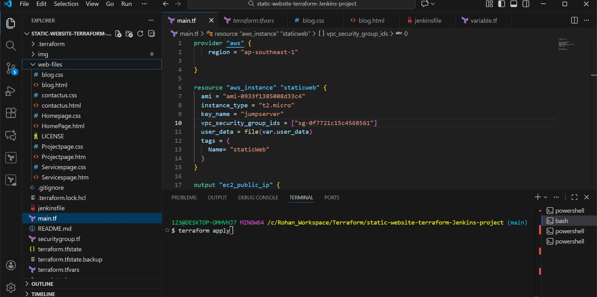
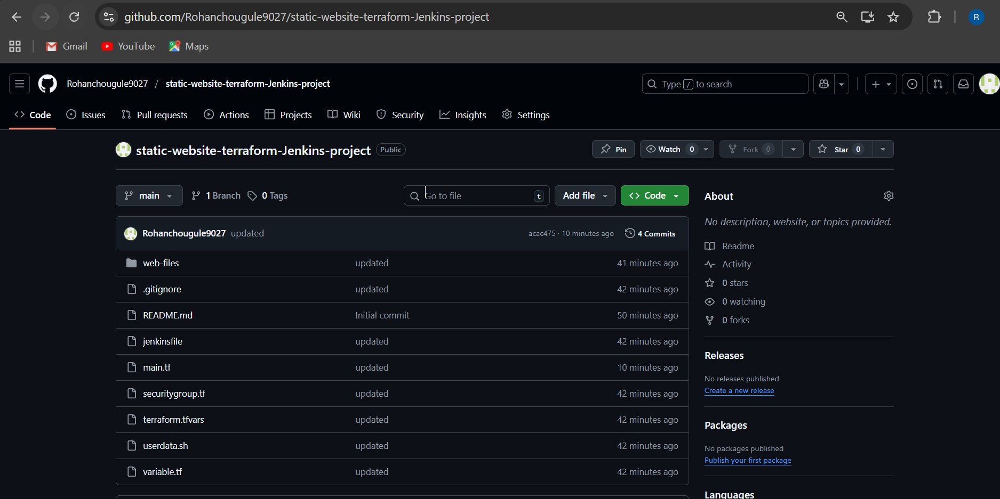
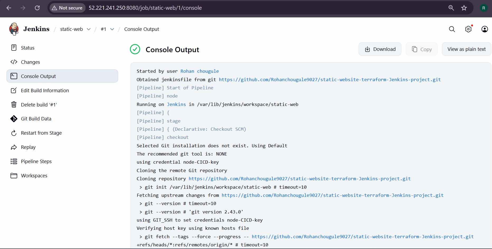
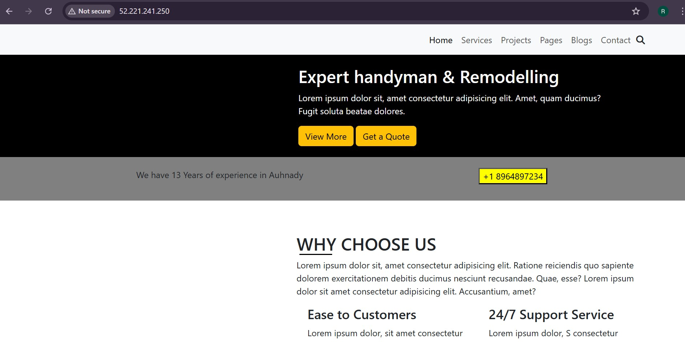
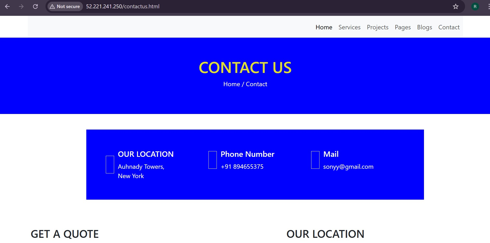

# 🚀 Static Website CI/CD Deployment using Terraform and Jenkins

### ⭐ Overview
This project demonstrates a fully automated CI/CD pipeline for deploying a static website to an AWS EC2 instance.
* Terraform provisions all AWS infrastructure
* Nginx hosts the static website
* Jenkins automates build & deployment
* GitHub Webhooks trigger automatic deployments on every push  
---  

### 🏗️ Architecture Diagram



---
### 📁 1. Clone the Repository and Modify Files
Clone the static website project to your local system and make required modifications.
```
git clone https://github.com/Rohanchougule9027/static-website-terraform-Jenkins-project.git
cd static-website-project
```
Modify HTML/CSS/JS files as per your UI changes.


---

### ⚙️ 2. Launch EC2 Instance using Terraform
A Terraform configuration is used to create:
* EC2 instance
* Security Group
* Key Pair
* User Data for Nginx setup

**Run Terraform :**
```
terraform init
terraform plan
terraform apply
```
After apply, Terraform will output the EC2 Public IP.


---

### 🛠️ 3. Jenkins Setup (Plugins + Credentials)
**✔ Install Plugins**
* Git Plugin
* ipeline Plugin
* SSH Agent Plugin
* GitHub Integration Plugin   

**Add Credentials**  
Navigate to :
```
Jenkins Dashboard → Manage Jenkins → Credentials → Global
```
Add:
* SSH Private Key (for EC2 deployment)
* GitHub token (optional)
---
### 📄 4. Add Jenkinsfile and Push to GitHub
Create a Jenkinsfile in the root of your repository.

Commit and push:
```
git add .
git commit -m "Added Jenkinsfile for CI/CD pipeline"
git push origin main
```
---
### 🔗 5. Configure GitHub Webhook
Go to your GitHub repository:  
```
Settings → Webhooks → Add Webhook
```
Enter:

* Payload URL: `http://<your-jenkins-ip>:8080/github-webhook/`
* Content type: `application/json`
* Trigger: `"Just the push event"`


---

### 🏃 6. Jenkins Build Process (Pipeline Flow)
Whenever the repository receives a new commit:
* Webhook triggers Jenkins
* Pipeline pulls the updated code
* Deployment is performed automatically    

You will see the output in Jenkins Console Logs.


---

### 7. Application Running Successfully
After successful deployment, open browser:
```
http://<EC2_PUBLIC_IP>
```
Your static website will load successfully.




---

### 🧭 Conclusion
This project shows how Terraform and Jenkins can fully automate the deployment of a static website on AWS. With Infrastructure-as-Code and a continuous delivery pipeline, every code change is deployed instantly and reliably, making the process fast, repeatable, and efficient. It provides a simple yet powerful example of real-world DevOps automation.

---